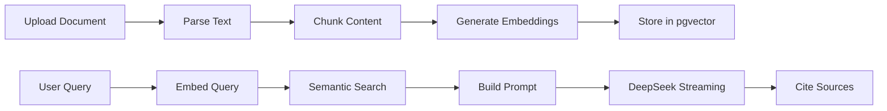
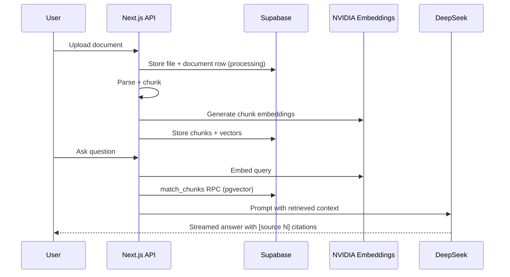

# DeepSeek RAG Template

A Retrieval-Augmented Generation starter using DeepSeek (via Nvidia API) + Supabase pgvector. Document upload, embeddings, semantic search, streaming citations — done right. No LangChain bloat.

## Features

- **Document Upload**: PDF, DOCX, MD, TXT support
- **Text Extraction + Chunking**: Smart chunking with 800 token chunks, 200 token overlap
- **Embedding Generation**: NVIDIA OpenAI-compatible `/v1/embeddings` (1536 dimensions; model via `NVIDIA_EMBEDDING_MODEL`)
- **Vector Storage**: Supabase pgvector with HNSW index
- **Semantic Search**: Cosine similarity with configurable threshold
- **Streaming Chat**: DeepSeek V4 Pro with real-time citations
- **Source Attribution**: See exactly which chunks answered your question
- **Multi-document Collections**: Filter chat by specific documents

## Demo GIF

Add your product walkthrough GIF here (recommended: ScreenToGif or Kap):

`docs/demo.gif`

## Architecture

```
Upload → Parse → Chunk → Embed → Store → Query → Retrieve → Generate
```



## Stack

| Layer | Tech |
|---|---|
| Framework | Next.js 14 (App Router) |
| AI | DeepSeek V4 Pro (via Nvidia API) |
| Embeddings | NVIDIA API (`/v1/embeddings`), default model `text-embedding-3-small` @ 1536d |
| Vector DB | Supabase pgvector extension |
| File parsing | pdf-parse, mammoth, markdown-it |
| UI | shadcn/ui + Tailwind |
| Hosting | Vercel |

## Setup

1. Clone the repo
2. Copy `.env.example` to `.env.local` and fill in keys

| Variable | Required | Description |
| --- | --- | --- |
| `NVIDIA_API_KEY` | Yes | Bearer token for NVIDIA integrate API (chat + embeddings) |
| `NVIDIA_API_BASE_URL` | No | Defaults to `https://integrate.api.nvidia.com/v1` |
| `NVIDIA_EMBEDDING_MODEL` | No | Defaults to `text-embedding-3-small`; must return **1536** dimensions for `vector(1536)` |
| `DEEPSEEK_MODEL` | No | Chat completion model id (default `deepseek-v4-pro`) |
| `NEXT_PUBLIC_SUPABASE_URL` | Yes | Supabase project URL |
| `NEXT_PUBLIC_SUPABASE_ANON_KEY` | Yes | Supabase anon key (browser) |
| `SUPABASE_SERVICE_ROLE_KEY` | Yes | Service role (API routes, `pnpm seed`) |
| `NEXT_PUBLIC_SITE_URL` | No | App origin for email confirmation links (e.g. `http://localhost:3000`) |
| `DEV_TEST_USER_EMAIL` | No | For `pnpm seed:dev-user`: set with password to override; if both omitted, built-in local defaults |
| `DEV_TEST_USER_PASSWORD` | No | For `pnpm seed:dev-user`: min 8 chars when set; must be set together with email to override defaults |

3. Run `pnpm install`
4. Set up Supabase with migrations in `supabase/migrations/`
   - `00001_initial.sql` (pgvector, tables, indexes, RLS, semantic search RPC)
   - `00002_storage_documents_bucket.sql` (private `documents` bucket + per-user storage policies)
   - `00003_documents_chunks_rls_authenticated.sql` (RLS scoped to `authenticated` + explicit `WITH CHECK`)
5. Run `pnpm dev`

## Supabase Auth (required)

The middleware and `/api/*` routes require a real Supabase session (`auth.getUser()`). Anonymous access is not used.

1. In the [Supabase Dashboard](https://supabase.com/dashboard) → **Authentication** → **Providers** → **Email**, enable **Email** (password sign-in).
2. Under **URL configuration**, set **Site URL** to your app origin (e.g. `http://localhost:3000` in dev).
3. Add **Redirect URL** `http://localhost:3000/auth/callback` (and your production callback URL) so email confirmation and magic links work.
4. Optional: set `NEXT_PUBLIC_SITE_URL` in `.env.local` to the same origin if signup builds redirect URLs server-side.

Users sign up at `/signup` and sign in at `/login`. Unauthenticated visitors to `/library`, `/upload`, `/chat`, or API routes are redirected or receive **401**.

If `/api/documents` returns **500** after login, open the response JSON (browser devtools → Network) for `details` / `code`. Typical causes: migrations not applied (`relation "documents" does not exist`), missing `documents` storage bucket (`00002`), or a stray newline in `SUPABASE_SERVICE_ROLE_KEY` in `.env.local` (fixed by trimming in code—still verify the key).

### Dev login user (optional)

For a repeatable local account without using the signup UI:

1. Ensure `.env.local` has `NEXT_PUBLIC_SUPABASE_URL` and `SUPABASE_SERVICE_ROLE_KEY`.
2. Run:

```bash
pnpm seed:dev-user
```

If `DEV_TEST_USER_EMAIL` and `DEV_TEST_USER_PASSWORD` are **both omitted**, the script uses local defaults (`dev@localhost.test` / `DevLocalOnly123!`) and prints a warning. To use your own credentials, set **both** variables (password at least 8 characters).

This uses the **service role** to create a **confirmed** email/password user, or reset the password if that email already exists. Use only on non-production projects; never commit real passwords.

## Demo Seed Data

Seed script downloads and indexes 3 sample PDFs (research + docs style) into your Supabase project:

```bash
pnpm seed
```

This uses service-role credentials and stores files in the `documents` bucket.

## Evaluation Set

A starter eval set is available at `evals/queries.json` with 10 test queries and expected answer themes.

Basic eval workflow:
1. Run seeded docs (`pnpm seed`)
2. Ask each query in chat
3. Manually verify:
   - answer quality
   - source citation quality
   - correct “I don't know” behavior for out-of-scope questions

## Why These Choices?

- **800 token chunks**: Balances context richness with retrieval precision
- **1536-d embeddings**: `pgvector` column is fixed at 1536; pick an NVIDIA catalog model that returns 1536 dimensions (default `text-embedding-3-small` with `dimensions: 1536` when supported)
- **DeepSeek via Nvidia API**: strong reasoning quality with OpenAI-compatible integration surface
- **No LangChain**: Direct SDK usage reduces bundle size and debugging complexity

## How It Works



## LangChain Comparison

- This template: direct SDKs, smaller surface area, fewer moving parts.
- Wrapper-heavy stacks: more abstraction, higher debug complexity, more dependency lock-in.
- Practical benefit: easier to reason about retrieval quality and prompt behavior.

## Usage Limits (Free Tier)

- Max **5 documents** per user (enforced in upload API; not Redis-backed)

## pgvector Setup

Enable the pgvector extension and run the migrations. The HNSW index provides <50ms retrieval on 100k+ chunks, and the storage migration creates a private `documents` bucket scoped to each authenticated user.

## Deployment (Vercel)

1. Import repo into Vercel
2. Add env vars:
   - `NVIDIA_API_KEY`
   - `NVIDIA_API_BASE_URL` (optional, defaults to `https://integrate.api.nvidia.com/v1`)
   - `NVIDIA_EMBEDDING_MODEL` (optional, defaults to `text-embedding-3-small`; must emit **1536** dimensions for current migrations)
   - `DEEPSEEK_MODEL` (optional, defaults to `deepseek-v4-pro`)
   - `NEXT_PUBLIC_SUPABASE_URL`
   - `NEXT_PUBLIC_SUPABASE_ANON_KEY`
   - `SUPABASE_SERVICE_ROLE_KEY`
3. Deploy
4. (Optional) Attach custom domain

## Troubleshooting

- **Build fails with missing envs**: ensure required keys are set in local shell/Vercel.
- **No chat answers**: verify Supabase chunk rows exist and `match_chunks` RPC is available.
- **Upload processing fails**: inspect `documents.error_message` and server logs/Sentry events.

## License

MIT
